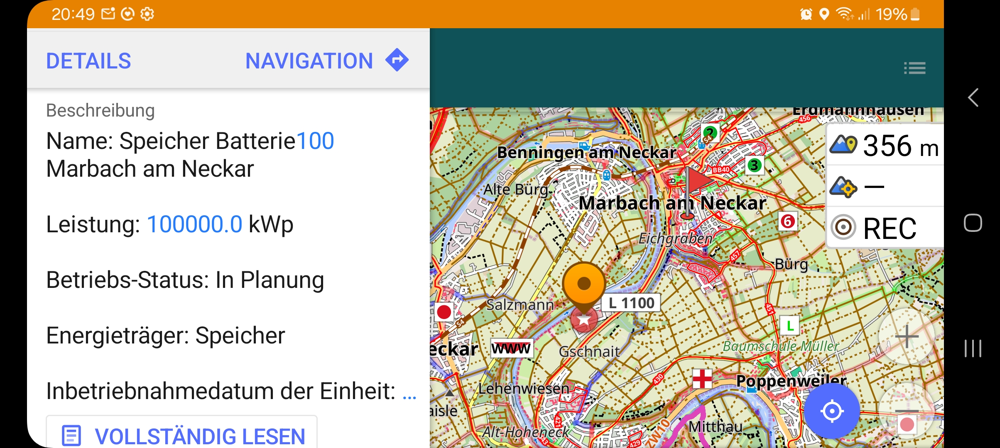
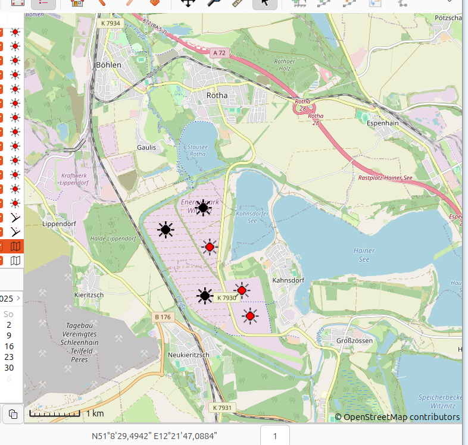

# Documentation

Die Tools in diesem Repository sollen bei der Auswertung der Daten des
Marktstammdatenregisters helfen. 

Zur Zeit gibt es nur ein Tool zum Lokalisieren der Anlagen

## Tool zum Lokalisieren von Energieanlagen

Um die Anlagen zu lokalisieren wird mit dem Tool ein GPX File erzeugt, in dem
die Anlagen als Waypoints markiert sind. Information zur Energieanlage können dann
mit den jeweiligen Tools direkt abgefragt werden.

Die Files können in einer Vielzahl von Handy-Apps, LabTop-Apps aber auch direkt Online
auf den Karten visualisiert werden.

Bisher gibt es nur eine Commandline Variante - die ist bisher nur mit Linux getestet, sollte aber auch Platform unabhängig funktionieren. 

Typische Anwendungsfälle sind:

- Suchen großer Solaranlagen ( > 10 MW )
- Suchen großer Solarparks ( > 90 MW ). Hierbei wird die flächige Suche unterstützt, da
  die Anlagen in der Nähe mit berücksichtigt werden müssen. Das gilt, da große Solarparks
  häufig aus mehren kleineren zusammengesetzt sind. Zwischen den Anlagen sind dann unter anderem Wildkorridore.
- Suchen von Batteriespeichern in der Nähe, auch große Speicher.
- Suchen von Windkraftanlagen und Windkraftanlagenparks.
- Alle Arten von Energieanlagen in unmittelbarer Nähe.

## Zur Tool Anwendung

Für jeden der obigen Fälle gibt es unterschiedlichste vorgehensweisen.
In jedem Fall muss von Marktstammdatenregister [MaStR](https://www.marktstammdatenregister.de/MaStR/Einheit/Einheiten/ErweiterteOeffentlicheEinheitenuebersicht) ein gefilltertes csv File runtergeladen werden. Nennen wir es im folgenden Beispiel 
<code>~/Downloads/Stromerzeuger(17).csv</code>, dieses Beispiel enthält nur die großen PV-Anlagen in ganz Deutschland. 

Das Tool liefert mit <code>mastrtogpx -h</code> eine kleine Hilfe in der die einstellbaren Parameter erläutert werden. Ein Aufruf hat immer die Gestalt:

~~~
usage: mastrtogpx [-h] [-q QUERY] [-o OUTPUT] [-c COLOR] [-m MIN_WEIGHT] [-r RADIUS]
                  [-a] [-s] [-h_query]
                  mastr_file
~~~

Das <code>mastr_file</code> ist das File, das vom MaStR Server heruntergeladen wurde.
Dann können noch weitere Einschränkungen über eine query spezifiziert werden.
So das schließlich in einem File mit allen Anlagen (auch Öl und Gas) einen Stadt, die jeweils 
interessanten untersucht werden können. Die Suchkriterien können mit der der Option <code>-s<code> angezeigt werden. Typische Beispiele finden sich über die Option 
<code>-h_query</code>. Die Punkte können mit einer Farbe markiert sein (nicht alle Tools 
unterstützen die Anzeige.) Für die Solarparks und Windparks gibt es zwei weitere 
Optionen mit <code>-r</code> wird ein Suchradius (um jeden Punkt) beschrieben (default 1 km) mit <code>-m</code> eine weitere Mintestschwelle für die BruttoenergieLeistung des Parks. Übersteigt der Park den Radius können auch mehrere Agregate nebeneinander angezeigt werden.

### Nur drei Beispiele:

**Kleinstes Beispiel**

Ein kleines Beispiel liefert ohne weitere Einschränkungen alle Anlagen, die als gefilterte Auswahl vom Server heruntergeladen wurden. Hier am Beisiel Landkreises-Ludwigburg:

~~~
mastrtogpx '~/Downloads/Stromerzeuger(15).csv' -o tmp/alles.gpx
~~~

(Das File <code>~/Downloads/Stromerzeuger(15).csv<code> enthält alle größeren Anlagen im 
Landkreis Ludwigsburg)

Diese Information ist geeignet, um schnell alle Anlagen und in der Region zu finden und
die wichtigsten Faktoren zu ermitteln.

**Suche der Großspeicher in der Nähe**:

Dies Beispiel hilft mir den Spromspeicher in Marbach genauer zu lokalisieren. Geeignet für
die nächste Fahrradtour. Das Ergebnis wird unten mit Hilfe der Handy-App OSMAnd dargestellt.

~~~
mastrtogpx '~/Downloads/Stromerzeuger(15).csv' -q 'is_speicher & BruttoleistungDerEinheit > 10000 & (BetriebsStatus != "Endgültig stillgelegt")' -o tmp/speicher.gpx -c Red
~~~

**Suche großer Solarparks in Deutschland**:

Das Zurechtfinden der wirklich großen Solarparks hilft die folgende Suche und das Ergebnis.
(Siehe auch Online Betrachter sowie Viking als PC Tool)

~~~
mastrtogpx '~/Downloads/Stromerzeuger(17).csv' -q 'is_pv & BruttoleistungDerEinheit > 10000 & (BetriebsStatus != "Endgültig stillgelegt")' -m 90000 -r 1000 -o tmp/ge_90_1000.gpx -c Black
~~~

## Tools to Visualize GPX Files

Here are links to some online viewers:

- [j-berkemeier](https://www.j-berkemeier.de/ShowGPX.html)

- [gpx.studio](https://gpx.studio/)

Mobile:

- [OSMAnd](https://osmand.net/)

Beispiel für die Suche eines Großspeichers in der Näche für die nächste Fahrradtour

PC:

- [Viking](https://wiki.openstreetmap.org/wiki/Viking)

